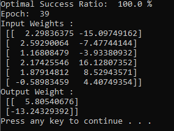
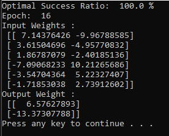

# Author
Nick Flouty

# Problem
Consider the Boolean function F(a0, a1, a2, b0, b1, b2) on 6 variables that takes value 1 if
the integer represented by the first three bits a0a1a2 is larger than the integer represented
by the last three bits b0b1b2. (For example, F(1, 0, 0, 0, 1, 1) is 1 since 100 represents
integer 4, and 011 represents integer 3. Train a neural network with a single hidden
layer with two neurons, and an output layer with one neuron. Choose a random initial
weights for neurons, and after each epoch, test on all the 64 inputs and report the best
success ratio found after 1000 epochs are completed.

# Outputs
Outputs vary, for the initial weights are random.

